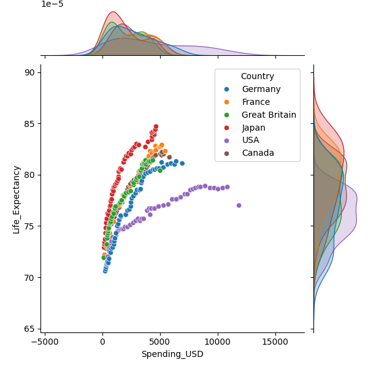

# 📊 Health Spending vs Life Expectancy

This project explores the relationship between how much a country spends on healthcare and its average life expectancy, using Seaborn’s built-in `healthexp` dataset. Through a series of visualizations, we aim to uncover patterns, outliers, and diminishing returns in healthcare investment.

---

## 📊 Objective
- Understand how health spending relates to life expectancy

- Observe whether more spending leads to significantly longer lives

- Use visuals like log scaling and hue to reveal deeper patterns

---

## 📁 Dataset

- **Source**: `seaborn.load_dataset("healthexp")`
- **Type**: Built-in Seaborn dataset
- `Features`
- **Spending_USD**: Health spending per capita
- **Life_Expectancy**: Average life expectancy in years
- **Country**: Name of the country
- **Year**: Year of the data (1970 to 2020)

The dataset was clean and required no preprocessing. For reproducibility, a copy is also saved as [`data/healthexp.csv`](data/healthexp.csv).

---

## 🖼️ Visualizations

### 1. Basic Jointplot (Scatter + Histogram)
Shows a banana-shaped curve, indicating diminishing returns of life expectancy as health spending increases.


---

### 2. Basic Jointplot (with regression line)
Shows the overall positive relationship between spending and life expectancy. However, the shape curves like a banana, indicating diminishing returns at higher spending levels.


---

### 3. Jointplot with Hue by Country
Adds color coding by `Country` to distinguish patterns per nation. Most useful when zooming into a few specific countries.



---

### 4. Jointplot with Log Scale
Using log scale on health spending straightens the scatter plot, revealing clearer upward trends. It shows clusters of countries forming linear patterns.


---


## 💡 Key Takeaways

- There's a positive relationship between healthcare spending and life expectancy, but the gains taper off at higher spending levels.
- The United States is a notable outlier — spending a lot more but not achieving a proportional life expectancy benefit.
- Log transformation helps better reveal meaningful clusters and relationships.
- Japan stand out with relatively high life expectancy for their spending.

---

## 🛠️ Tech Stack

- Python
- Seaborn
- Pandas
- Matplotlib

---

## 📂 Folder Structure
```
.
├── data/
│ └── healthexp.csv
├── images/
│ ├── jointplot_basic.png
│ └── jointplot_log_hue.png
├── visualize.py
├── requirements.txt
├── .gitignore
└── README.md

```
📘 **For more detailed insight**, check the notebook: `HealthViz.ipynb`

---

## 🧠 Inspiration

This project was done to explore how a single, clean visualization can carry meaningful public health insight — especially for non-technical audiences. It's part of a broader interest in using data science to address health challenges in Africa and beyond.

---


